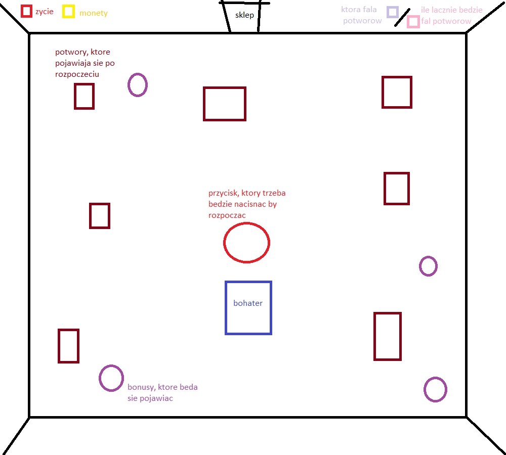

# Binding_of_Rhen

## POPRAWIK

Poprawiony został system chodzenia przeciwników (bardziej randomowo), niektóre potworki strzelają małymi shootami w randomowych kierunkach, oraz na końcu (po zagiciu wszystkich mniejszych potworów) został dodany Boss, który strzela w kierunku bohatera.

***Gra będzie inspirowana grą The binding of Isaac***

Po włączeniu gry pojawi się pomieszczenie z postacią i guzikiem na środku, po wciśnięciu którego rozpocznie się odliczanie do startu. Rozpocznie się fala potworów (minimalnie będą 3), przez co rozumiem, że pojawią się potwory w ustalonych wcześniej w osobnym pliku tekstowym pozycjach, które będą się poruszać wektorowo w losowych kierunkach. Naszym bohaterem będziemy mogli poruszać z pomocą WSAD również wektorowo. Strzelać będziemy za pomocą myszki (gdzie się kliknie, w tym kierunku podąży strzał). Na planszy będą pojawiać się dodatkowe monety oraz dodatkowe życie do zebrania. Po każdej fali dodana zostanie określona ilość monet, za które będzie można w sklepie kupić bonusy do gry (np. szybsze strzelanie, spowolnienie potworów przez określony czas po nacisnięciu 'E' itp.).

W tle będzie lecieć muzyka oraz z każdym strzałem będzie dźwiek tego wystrzału. 

Opis potworków:
-najłatwiejsze potworki, które będą w pierwszej fali będą łatwe do zabicia, ale będą dość szybko się poruszać
-jeden z potworków na początku będzie wolny, jak się go zabije, to rozdzieli się na dwie części i przyspieszy

# Instrukcja obsugi

Graczem steruje się poprzez WSAD, atakuje się Spacją. Po rozpoczęciu gry można wrócić do menu wciskając Escape.

